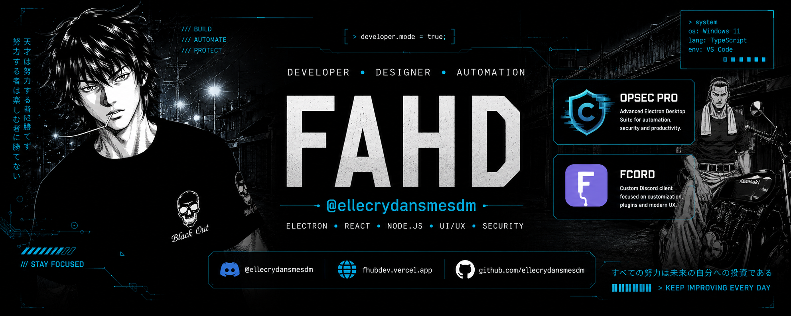
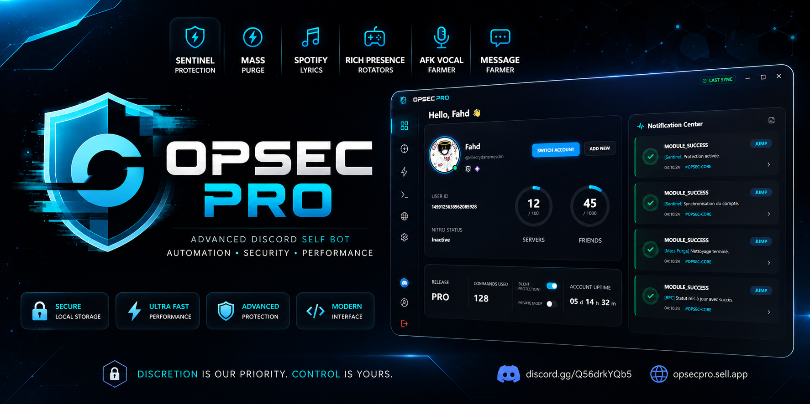
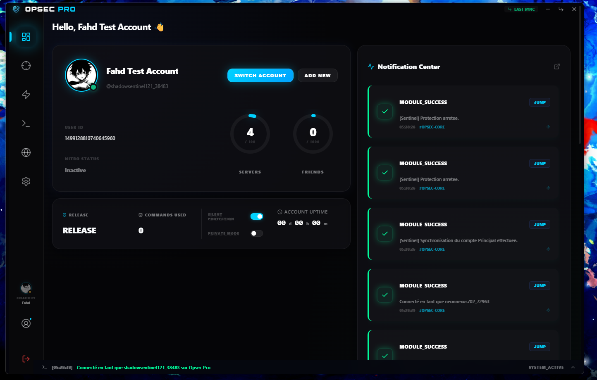
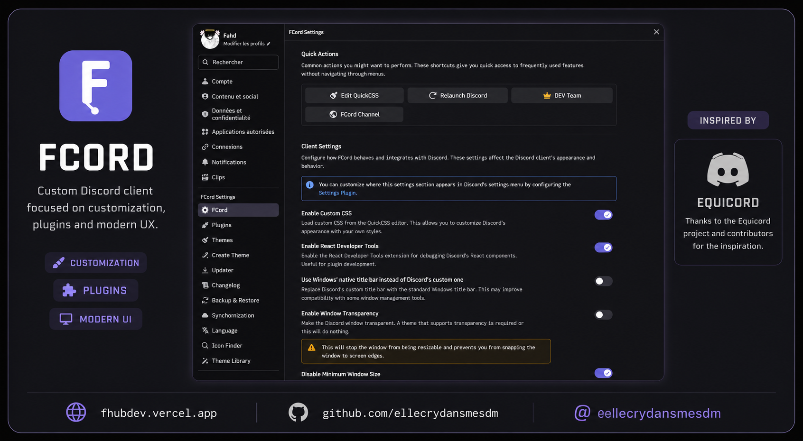
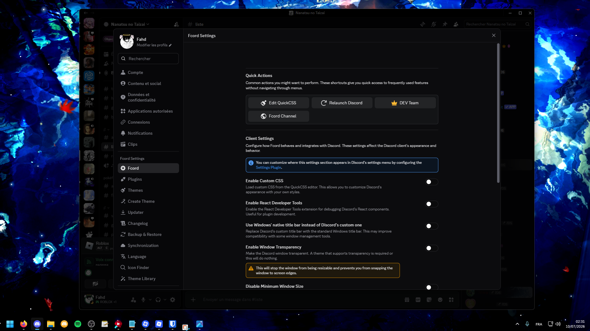

<div align="center">



<br>

# Fahd

### Desktop Application Developer

### Electron • React • TypeScript

<p>
<a href="https://fhubdev.vercel.app"></a>
<a href="https://github.com/ellecrydansmesdm"></a>

</p>


<p align="center">

</p>

</div>

---

# 👋 About

A desktop product builder using Electron, React and TypeScript. I ship polished Windows applications with modern UI, clean architecture and practical workflows.

- Desktop-first UX
- Native-like Electron performance
- Modular maintainable code
- Release-ready polish

---

# ⚙️ Tech Stack

<p align="center">

</p>

---

# 📊 GitHub Activity

<p align="center">

</p>

<br>

<p align="center">

</p>

---

# 🛡️ Opsec PRO

<p align="center">

</p>

> Desktop Discord toolkit built on Electron with a sharp, modern control surface.

<p align="center">
<a href="https://github.com/ellecrydansmesdm/Opsec-PRO"></a>
</p>

<p align="center">

</p>

A secure desktop workspace for Discord power users:

- Modular dashboard
- Multi-account management
- Encrypted local storage
- Rich Presence controls
- Native-like update flow

<p align="center">

</p>

---

# 💬 FCord

<p align="center">

</p>

> Custom Discord client designed for speed, themes and desktop consistency.

<p align="center">
<a href="https://github.com/ellecrydansmesdm/Fcord"></a>
</p>

<p align="center">

</p>

Built to feel like a real desktop app:

- Theme & plugin-ready shell
- Fast startup
- Smooth messaging workflow
- Modular Electron architecture

<p align="center">

</p>

---

# 🎯 Current Focus

```text
✔ Shipping Opsec PRO
✔ Evolving FCord
✔ Improving desktop UX
✔ Strengthening Electron architecture
✔ Delivering polished releases
```

---

# 🤝 Contact

<p align="center">
<a href="https://fhubdev.vercel.app"></a>
<a href="https://github.com/ellecrydansmesdm"></a>

</p>

<div align="center">

### Currently building
🛡️ Opsec PRO • 💬 FCord • Desktop software • Electron products

<br>


</div>
